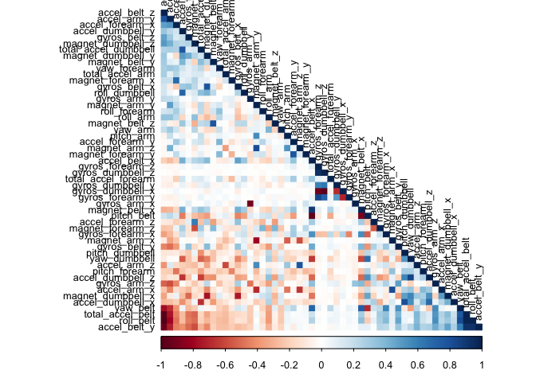
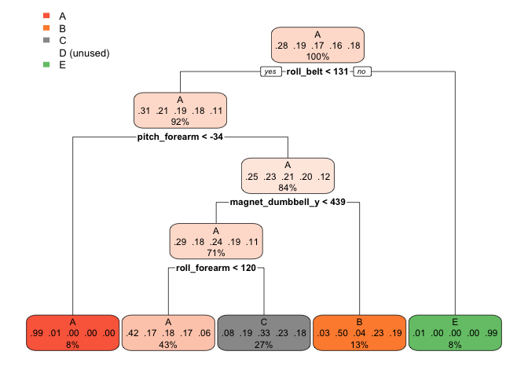
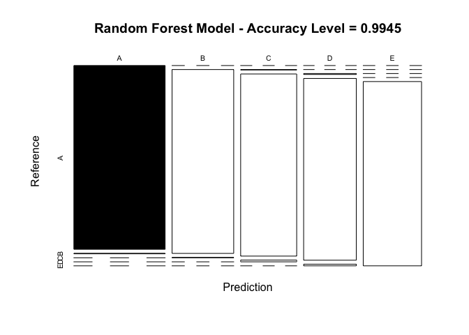
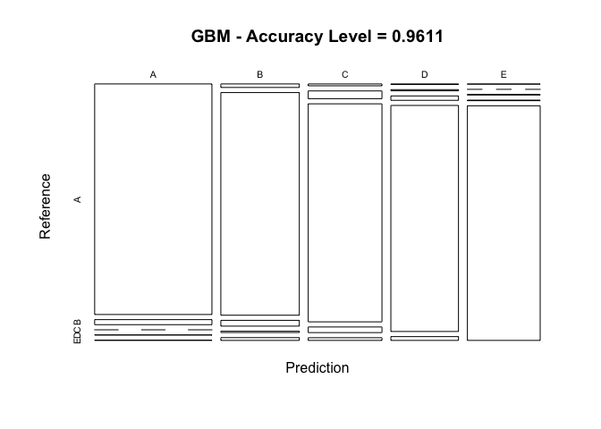

## Coursera Practical Machine Learning - Course Project
### Human Activity Recognition

## Summary
Using devices such as Jawbone Up, Nike FuelBand, and Fitbit it is now possible to collect a large amount of data about personal activity relatively inexpensively. These type of devices are part of the quantified self movement – a group of enthusiasts who take measurements about themselves regularly to improve their health, to find patterns in their behavior, or because they are tech geeks. One thing that people regularly do is quantify how much of a particular activity they do, but they rarely quantify how well they do it. In this project, we will us the data from accelerometers on the belt, forearm, arm, and dumbell of 6 participants. They were asked to perform barbell lifts correctly and incorrectly in 5 different ways, reflected on the variable **classe**, which contains the following levels:

Class A: exactly according to the specification
Class B: throwing the elbows to the front
Class C: lifting the dumbbell only halfway
Class D: lowering the dumbbell only halfway
Class E: throwing the hips to the front


This analysis will be based on the data available by the researchers on: http://web.archive.org/web/20161224072740/http:/groupware.les.inf.puc-rio.br/har. The dataset consists of a training set and a test set that will be later used to evaluate the models created. 


```r
train_ds_raw <- read.csv(
    file=url("https://d396qusza40orc.cloudfront.net/predmachlearn/pml-training.csv")
    )
test_ds_raw<- read.csv(
  file=url("https://d396qusza40orc.cloudfront.net/predmachlearn/pml-testing.csv")
  )
```

The training dataset consists of 19622 rows and  160 variables.
The test dataset consists of 20 rows and  160 variables.


```r
## Analyzing the Train Dataset
str(train_ds_raw, list.len=30)
```

```
## 'data.frame':	19622 obs. of  160 variables:
##  $ X                       : int  1 2 3 4 5 6 7 8 9 10 ...
##  $ user_name               : chr  "carlitos" "carlitos" "carlitos" "carlitos" ...
##  $ raw_timestamp_part_1    : int  1323084231 1323084231 1323084231 1323084232 1323084232 1323084232 1323084232 1323084232 1323084232 1323084232 ...
##  $ raw_timestamp_part_2    : int  788290 808298 820366 120339 196328 304277 368296 440390 484323 484434 ...
##  $ cvtd_timestamp          : chr  "05/12/2011 11:23" "05/12/2011 11:23" "05/12/2011 11:23" "05/12/2011 11:23" ...
##  $ new_window              : chr  "no" "no" "no" "no" ...
##  $ num_window              : int  11 11 11 12 12 12 12 12 12 12 ...
##  $ roll_belt               : num  1.41 1.41 1.42 1.48 1.48 1.45 1.42 1.42 1.43 1.45 ...
##  $ pitch_belt              : num  8.07 8.07 8.07 8.05 8.07 8.06 8.09 8.13 8.16 8.17 ...
##  $ yaw_belt                : num  -94.4 -94.4 -94.4 -94.4 -94.4 -94.4 -94.4 -94.4 -94.4 -94.4 ...
##  $ total_accel_belt        : int  3 3 3 3 3 3 3 3 3 3 ...
##  $ kurtosis_roll_belt      : chr  "" "" "" "" ...
##  $ kurtosis_picth_belt     : chr  "" "" "" "" ...
##  $ kurtosis_yaw_belt       : chr  "" "" "" "" ...
##  $ skewness_roll_belt      : chr  "" "" "" "" ...
##  $ skewness_roll_belt.1    : chr  "" "" "" "" ...
##  $ skewness_yaw_belt       : chr  "" "" "" "" ...
##  $ max_roll_belt           : num  NA NA NA NA NA NA NA NA NA NA ...
##  $ max_picth_belt          : int  NA NA NA NA NA NA NA NA NA NA ...
##  $ max_yaw_belt            : chr  "" "" "" "" ...
##  $ min_roll_belt           : num  NA NA NA NA NA NA NA NA NA NA ...
##  $ min_pitch_belt          : int  NA NA NA NA NA NA NA NA NA NA ...
##  $ min_yaw_belt            : chr  "" "" "" "" ...
##  $ amplitude_roll_belt     : num  NA NA NA NA NA NA NA NA NA NA ...
##  $ amplitude_pitch_belt    : int  NA NA NA NA NA NA NA NA NA NA ...
##  $ amplitude_yaw_belt      : chr  "" "" "" "" ...
##  $ var_total_accel_belt    : num  NA NA NA NA NA NA NA NA NA NA ...
##  $ avg_roll_belt           : num  NA NA NA NA NA NA NA NA NA NA ...
##  $ stddev_roll_belt        : num  NA NA NA NA NA NA NA NA NA NA ...
##  $ var_roll_belt           : num  NA NA NA NA NA NA NA NA NA NA ...
##   [list output truncated]
```

```r
str(test_ds_raw, list.len = 30)
```

```
## 'data.frame':	20 obs. of  160 variables:
##  $ X                       : int  1 2 3 4 5 6 7 8 9 10 ...
##  $ user_name               : chr  "pedro" "jeremy" "jeremy" "adelmo" ...
##  $ raw_timestamp_part_1    : int  1323095002 1322673067 1322673075 1322832789 1322489635 1322673149 1322673128 1322673076 1323084240 1322837822 ...
##  $ raw_timestamp_part_2    : int  868349 778725 342967 560311 814776 510661 766645 54671 916313 384285 ...
##  $ cvtd_timestamp          : chr  "05/12/2011 14:23" "30/11/2011 17:11" "30/11/2011 17:11" "02/12/2011 13:33" ...
##  $ new_window              : chr  "no" "no" "no" "no" ...
##  $ num_window              : int  74 431 439 194 235 504 485 440 323 664 ...
##  $ roll_belt               : num  123 1.02 0.87 125 1.35 -5.92 1.2 0.43 0.93 114 ...
##  $ pitch_belt              : num  27 4.87 1.82 -41.6 3.33 1.59 4.44 4.15 6.72 22.4 ...
##  $ yaw_belt                : num  -4.75 -88.9 -88.5 162 -88.6 -87.7 -87.3 -88.5 -93.7 -13.1 ...
##  $ total_accel_belt        : int  20 4 5 17 3 4 4 4 4 18 ...
##  $ kurtosis_roll_belt      : logi  NA NA NA NA NA NA ...
##  $ kurtosis_picth_belt     : logi  NA NA NA NA NA NA ...
##  $ kurtosis_yaw_belt       : logi  NA NA NA NA NA NA ...
##  $ skewness_roll_belt      : logi  NA NA NA NA NA NA ...
##  $ skewness_roll_belt.1    : logi  NA NA NA NA NA NA ...
##  $ skewness_yaw_belt       : logi  NA NA NA NA NA NA ...
##  $ max_roll_belt           : logi  NA NA NA NA NA NA ...
##  $ max_picth_belt          : logi  NA NA NA NA NA NA ...
##  $ max_yaw_belt            : logi  NA NA NA NA NA NA ...
##  $ min_roll_belt           : logi  NA NA NA NA NA NA ...
##  $ min_pitch_belt          : logi  NA NA NA NA NA NA ...
##  $ min_yaw_belt            : logi  NA NA NA NA NA NA ...
##  $ amplitude_roll_belt     : logi  NA NA NA NA NA NA ...
##  $ amplitude_pitch_belt    : logi  NA NA NA NA NA NA ...
##  $ amplitude_yaw_belt      : logi  NA NA NA NA NA NA ...
##  $ var_total_accel_belt    : logi  NA NA NA NA NA NA ...
##  $ avg_roll_belt           : logi  NA NA NA NA NA NA ...
##  $ stddev_roll_belt        : logi  NA NA NA NA NA NA ...
##  $ var_roll_belt           : logi  NA NA NA NA NA NA ...
##   [list output truncated]
```

As can be observed by the summary the dataset contains a significant number of variables with null and blank values, which would not add to our analysis. Therefore we will have to clean the dataset by:

1. Removing variables with Near Nero Variance from our dataset.

```r
## Removing NearZeroVariance variables

train_dsNZV <- nearZeroVar(train_ds_raw)
train_ds_raw <- train_ds_raw[,-train_dsNZV]
test_ds_raw  <- test_ds_raw[,-train_dsNZV]
```

2. Removing variables having  all values as N/A.

```r
## Removing N/A's
train_ds_raw <- train_ds_raw[, colSums(is.na(train_ds_raw)) == 0]
test_ds_raw <- test_ds_raw[, colSums(is.na(test_ds_raw)) == 0]
```


3. Removing non-numeric variables that will not be used in our analysis (such as date and labels)

```r
train_ds_raw <- train_ds_raw[,-(1:6)]
test_ds_raw <- test_ds_raw[,-(1:6)]
```

With that our new dataset now has the following dimensions:

The training dataset after adjustments consists of 19622 rows and  53 variables.
The test dataset after adjustments consists of 20 rows and  53 variables.


## Correlation Analysis

A correlation analysis is performed on our training dataset to understand how the variables relates with each other and  how that could impact our analysis. The variables with higher correlation have darker colors in the graph below. A Principal Component Analysis could be performed to optimize variables selection, but as there are few variables strongly correlated in our datasets we won't perform such analysis.

<!-- -->

## Model Building

To start creating the models we will first split our training dataset, having 75% used for training the models and 25% to be used as a cross validation.


```
## [1] 14718    53
```

### Applying ML Models
We will start applying different machine learning techiniques to find the one with best accuracy on identifying the correct **classe** result for each observation. The techiniques used in this analysis will be Decison Trees, Random Forests and Gradient Boost. After applying the model to the cross validation dataset a confusion matrix will be created to assess the accuracy of the model.

#### a) Decision Trees

```r
modDecisionTree <- train(classe ~ ., data = training, method="rpart")
```

<!-- -->


```
## Confusion Matrix and Statistics
## 
##           Reference
## Prediction    A    B    C    D    E
##          A 1242   26  124    0    3
##          B  397  322  230    0    0
##          C  413   30  412    0    0
##          D  351  128  325    0    0
##          E  138  119  247    0  397
## 
## Overall Statistics
##                                          
##                Accuracy : 0.4839         
##                  95% CI : (0.4698, 0.498)
##     No Information Rate : 0.5181         
##     P-Value [Acc > NIR] : 1              
##                                          
##                   Kappa : 0.3257         
##                                          
##  Mcnemar's Test P-Value : NA             
## 
## Statistics by Class:
## 
##                      Class: A Class: B Class: C Class: D Class: E
## Sensitivity            0.4888  0.51520  0.30792       NA  0.99250
## Specificity            0.9353  0.85347  0.87577   0.8361  0.88810
## Pos Pred Value         0.8903  0.33930  0.48187       NA  0.44062
## Neg Pred Value         0.6298  0.92339  0.77130       NA  0.99925
## Prevalence             0.5181  0.12745  0.27284   0.0000  0.08157
## Detection Rate         0.2533  0.06566  0.08401   0.0000  0.08095
## Detection Prevalence   0.2845  0.19352  0.17435   0.1639  0.18373
## Balanced Accuracy      0.7120  0.68434  0.59185       NA  0.94030
```

The decision tree does not show a good accuracy, being able to identify 48.3891% of the observations correctly.

#### b) Random Forests


```r
mod_random_forest<-train(classe ~ ., data=training ,method="rf", ntree = 100)
```


```
## Confusion Matrix and Statistics
## 
##           Reference
## Prediction    A    B    C    D    E
##          A 1395    4    0    0    0
##          B    0  943    2    0    0
##          C    0    2  849    8    0
##          D    0    0    4  796    7
##          E    0    0    0    0  894
## 
## Overall Statistics
##                                          
##                Accuracy : 0.9945         
##                  95% CI : (0.992, 0.9964)
##     No Information Rate : 0.2845         
##     P-Value [Acc > NIR] : < 2.2e-16      
##                                          
##                   Kappa : 0.993          
##                                          
##  Mcnemar's Test P-Value : NA             
## 
## Statistics by Class:
## 
##                      Class: A Class: B Class: C Class: D Class: E
## Sensitivity            1.0000   0.9937   0.9930   0.9900   0.9922
## Specificity            0.9989   0.9995   0.9975   0.9973   1.0000
## Pos Pred Value         0.9971   0.9979   0.9884   0.9864   1.0000
## Neg Pred Value         1.0000   0.9985   0.9985   0.9980   0.9983
## Prevalence             0.2845   0.1935   0.1743   0.1639   0.1837
## Detection Rate         0.2845   0.1923   0.1731   0.1623   0.1823
## Detection Prevalence   0.2853   0.1927   0.1752   0.1646   0.1823
## Balanced Accuracy      0.9994   0.9966   0.9953   0.9937   0.9961
```

The random forest model shows a good accuracy, being able to identify 99.4494% of the observations correctly.

<!-- -->

#### c) Gradient Boosting Model (GBM)


```r
#Using trControl to add parallelism and speed up the execution
model_gbm <-train(classe ~ ., data=training,method="gbm", verbose = FALSE,trControl = fitControl)
```


```
## Confusion Matrix and Statistics
## 
##           Reference
## Prediction    A    B    C    D    E
##          A 1371   30    0    1    1
##          B   14  886   23    5   11
##          C    7   29  815   21   10
##          D    2    4   15  775   13
##          E    1    0    2    2  866
## 
## Overall Statistics
##                                           
##                Accuracy : 0.9611          
##                  95% CI : (0.9553, 0.9663)
##     No Information Rate : 0.2845          
##     P-Value [Acc > NIR] : < 2e-16         
##                                           
##                   Kappa : 0.9507          
##                                           
##  Mcnemar's Test P-Value : 2.2e-05         
## 
## Statistics by Class:
## 
##                      Class: A Class: B Class: C Class: D Class: E
## Sensitivity            0.9828   0.9336   0.9532   0.9639   0.9612
## Specificity            0.9909   0.9866   0.9835   0.9917   0.9988
## Pos Pred Value         0.9772   0.9436   0.9240   0.9580   0.9943
## Neg Pred Value         0.9931   0.9841   0.9901   0.9929   0.9913
## Prevalence             0.2845   0.1935   0.1743   0.1639   0.1837
## Detection Rate         0.2796   0.1807   0.1662   0.1580   0.1766
## Detection Prevalence   0.2861   0.1915   0.1799   0.1650   0.1776
## Balanced Accuracy      0.9868   0.9601   0.9683   0.9778   0.9800
```

The gradient boosting model also shows a good accuracy, being able to identify 96.1052% of the observations correctly.

<!-- -->

## Conclusion

In conclusion, after evaluating each model we observed that the **random forest model** shows the best fit being able to predict with higher precision than other models the variable **classe** for each observation and therefore, will be used to predict the **classe** variable in our testing dataset.


```
##                                Accuracy           
## [1,] "Decision Tree Model"     "0.483890701468189"
## [2,] "Random Forest Model"     "0.994494290375204"
## [3,] "Gradient Boosting Model" "0.96105220228385"
```


## Predicting on the test data


```r
bestModel <- mod_random_forest
predict <- predict(bestModel, newdata=test_ds_raw)
predict
```

```
##  [1] B A B A A E D B A A B C B A E E A B B B
## Levels: A B C D E
```
